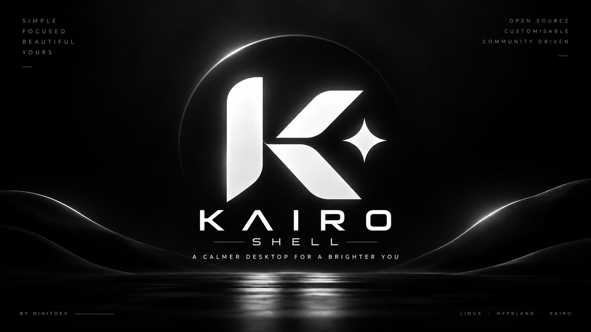

<p align="center">
  
</p>

<h1 align="center">Kairo Shell</h1>

<p align="center">
  <strong>A polished desktop shell for Hyprland.</strong>
</p>

<p align="center">
  Fast. Focused. Customizable. Built for the Kairo desktop experience.
</p>

<p align="center">
  <a href="#features">Features</a> •
  <a href="#installation">Installation</a> •
  <a href="#usage">Usage</a> •
  <a href="#configuration">Configuration</a> •
  <a href="#theming">Theming</a> •
  <a href="#development">Development</a>
</p>

---

## About

**Kairo Shell** is a desktop shell designed for **Hyprland**, built around a clean visual language, useful desktop controls, and a keyboard-first workflow.

It provides the pieces normally scattered across many independent utilities — a bar, application launcher, clipboard interface, media controls, system controls, notifications, wallpaper management, screenshots, workspace controls, lock screen integration, weather, and more — as one cohesive shell.

Kairo Shell is intended to feel like part of the desktop rather than a collection of unrelated widgets.

The project is built primarily with **Quickshell/QML**, supported by shell and Python utilities where appropriate, and integrates directly with Hyprland.

Kairo Shell is also designed to be the graphical shell component of the wider **Kairo** Arch Linux workstation environment.

> **Kairo — Arch, composed.**

---

## Features

### Desktop shell

Kairo provides a complete shell layer around Hyprland, including:

- Desktop bar and workspace controls
- Application launcher
- Clipboard manager interface
- Notification center
- System and quick-action panels
- Audio and volume controls
- Media controls
- Network interface
- Wallpaper picker
- Screenshot interface
- Lock screen integration
- Brightness controls
- Weather information
- Calendar and time widgets
- Current-window information
- Monitor detection
- Blue-light controls
- User guide and shell settings

The individual components share the same configuration and visual system so the desktop remains consistent.

### Hyprland first

Kairo Shell focuses specifically on **Hyprland**.

Rather than maintaining several compositor-specific implementations, Kairo keeps its integration focused and predictable. Workspace switching, window information, screenshots, shell IPC, keybindings, and desktop behavior are designed around a Hyprland session.

### Keyboard-driven workflow

Most shell functionality can be triggered directly through the `kairo` command, making it easy to connect Kairo to Hyprland keybindings.

Examples include:

```bash
kairo msg toggle launcher
kairo msg toggle clipboard
kairo msg toggle music
kairo msg toggle system
kairo msg toggle wallpaper
kairo msg toggle calendar
kairo msg toggle network
kairo msg toggle volume
kairo msg toggle guide
```

This allows the shell UI and your compositor configuration to remain loosely coupled while still working together.

### CLI and daemon

Kairo ships two primary commands:

```text
kairo
kairod
```

`kairo` is the user-facing shell command and IPC interface.

`kairod` manages the shell process and its lifecycle.

For example:

```bash
kairod start
kairod stop
kairod status
```

Check available commands with:

```bash
kairo --help
kairod --help
```

---

## Installation

### Requirements

Kairo Shell is intended for an Arch Linux + Hyprland environment.

The exact dependencies depend on which shell functionality you use, but the project expects a working Hyprland desktop and the runtime dependencies used by the included Quickshell configuration and helper scripts.

### Local installation

Clone the repository:

```bash
git clone https://github.com/nihitdev/kairo-shell.git
cd kairo-shell
```

Install the current checkout:

```bash
bash install/install.sh --local
```

The installer places the shell files in the appropriate user directories and installs the `kairo` and `kairod` launchers.

After installation, start Kairo with:

```bash
kairod start
```

Check its status with:

```bash
kairod status
```

Stop it with:

```bash
kairod stop
```

### Installer options

See all currently supported installer options with:

```bash
bash install/install.sh --help
```

Kairo's installer supports local development installations as well as optional Hyprland integration.

For example:

```bash
bash install/install.sh --local --integrate-hyprland
```

Review installer output before enabling compositor integration if you already maintain a heavily customized Hyprland configuration.

---

## Hyprland integration

Kairo can be started automatically with your Hyprland session.

For a Lua-based Hyprland configuration, the startup command is:

```lua
hl.exec_cmd("kairod start")
```

The exact location depends on how your Hyprland configuration is organized.

A common layout is:

```text
~/.config/hypr/
├── hyprland.lua
└── config/
    ├── autostart.lua
    ├── keybinds.lua
    └── variables.lua
```

Kairo's shell commands can then be attached to your preferred keybindings.

Example:

```lua
hl.bind(mainMod .. " + SPACE", hl.dsp.exec_cmd("kairo msg toggle launcher"))
hl.bind(mainMod .. " + V", hl.dsp.exec_cmd("kairo msg toggle clipboard"))
hl.bind(mainMod .. " + M", hl.dsp.exec_cmd("kairo msg toggle music"))
hl.bind(mainMod .. " + B", hl.dsp.exec_cmd("kairo msg toggle system"))
hl.bind(mainMod .. " + W", hl.dsp.exec_cmd("kairo msg toggle wallpaper"))
hl.bind(mainMod .. " + G", hl.dsp.exec_cmd("kairo msg toggle calendar"))
hl.bind(mainMod .. " + N", hl.dsp.exec_cmd("kairo msg toggle network"))
hl.bind(mainMod .. " + A", hl.dsp.exec_cmd("kairo msg toggle volume"))
hl.bind(mainMod .. " + H", hl.dsp.exec_cmd("kairo msg toggle guide"))
```

You are not required to use these exact bindings. Kairo is deliberately exposed through commands so you can map the shell around your own workflow.

---

## Usage

Start the shell:

```bash
kairod start
```

Inspect its state:

```bash
kairod status
```

Reload Kairo:

```bash
kairo reload
```

Open the launcher:

```bash
kairo msg toggle launcher
```

Open the clipboard:

```bash
kairo msg toggle clipboard
```

Open the system panel:

```bash
kairo msg toggle system
```

Open wallpaper controls:

```bash
kairo msg toggle wallpaper
```

Take a screenshot:

```bash
kairo screenshot
```

Lock the session:

```bash
kairo lock
```

Control brightness:

```bash
kairo brightness raise
kairo brightness lower
```

Control volume:

```bash
kairo volume raise
kairo volume lower
kairo volume mute-toggle
```

For the authoritative list of commands provided by your installed version:

```bash
kairo --help
```

---

## Configuration

User configuration is stored under:

```text
~/.config/kairo/
```

The primary settings file is:

```text
~/.config/kairo/settings.json
```

This keeps user configuration separate from the installed application files.

Application data is installed under:

```text
~/.local/share/kairo/
```

The launchers are normally available through:

```text
~/.local/bin/kairo
~/.local/bin/kairod
```

State generated while the shell is running may be stored beneath:

```text
~/.local/state/kairo/
```

Keeping configuration, application data, and runtime state separate makes local development and upgrades easier to reason about.

---

## Theming

Kairo includes a unified theme system used throughout the shell.

Included theme presets currently include themes such as:

```text
Dracula
Gruvbox
Matugen
Monokai
Nord
Tokyo
Tokyo Storm
```

The active preset is controlled through Kairo's settings.

Kairo also supports Matugen-based dynamic colors for users who want their desktop palette generated from their wallpaper.

If you prefer a fixed preset instead, Matugen can be disabled and another theme selected.

The long-term visual direction of Kairo focuses on:

- Clean typography
- Strong contrast
- Subtle transparency
- Minimal visual noise
- Consistent spacing
- Smooth interaction
- A desktop that stays out of your way

The goal is not simply to add more widgets. The goal is to make every part of the shell feel like it belongs there.

---

## Project structure

A simplified view of the repository:

```text
kairo-shell/
├── bin/
│   ├── kairo
│   └── kairod
├── config/
│   └── kairo/
├── docs/
│   └── images/
├── install/
│   ├── install.sh
│   └── modules/

├── src/
│   ├── assets/
│   ├── quickshell/
│   └── scripts/
├── tests/

├── LICENSE
├── README.md
└── UPSTREAM.md
```

### `bin/`

Contains the main Kairo CLI and daemon entrypoints.

### `config/`

Contains default Kairo configuration shipped with the project.

### `install/`

Contains the installation system and deployment modules.

### `src/quickshell/`

Contains the main QML/Quickshell desktop shell implementation.

### `src/scripts/`

Contains helper utilities used by shell components.

### `src/assets/`

Contains themes, translations, sounds, icons, tutorial data, and other resources.

### `tests/`

Contains regression tests used to protect the Kairo migration and project structure.


---

## Development

Clone the project:

```bash
git clone https://github.com/nihitdev/kairo-shell.git
cd kairo-shell
```

Create your changes in the repository and install the current checkout with:

```bash
bash install/install.sh --local
```

Restart Kairo after changes:

```bash
kairod stop
kairod start
```

For shell development, running Kairo from a terminal can also be useful because runtime warnings and QML errors remain visible.

### Running tests

The migration regression suite can be run with:

```bash
/usr/bin/python3 -m pytest -q tests/test_migration.py
```

Before committing, also check Git whitespace/errors:

```bash
git diff --check
```

A useful basic validation sequence is:

```bash
/usr/bin/python3 -m pytest -q tests/test_migration.py
git diff --check
kairo --version
kairod --version
```

---

## Design philosophy

Kairo follows a few simple ideas.

**The desktop should feel cohesive.**  
A launcher, bar, notification center, wallpaper picker, and system panel should not feel like five unrelated programs.

**Customization should remain possible.**  
Kairo provides defaults, but the shell should adapt to the person using it rather than forcing one workflow.

**Hyprland integration should be explicit.**  
Shell actions are exposed through commands and IPC so keybindings remain understandable and user-controlled.

**Configuration should stay inspectable.**  
Settings and scripts should remain accessible rather than hiding everything behind opaque state.

**Visual polish should serve usability.**  
Animations, transparency, color, and effects should make interactions clearer — not turn the desktop into a benchmark.

---

## Kairo ecosystem

Kairo Shell is designed as the graphical desktop-shell component of the wider Kairo project.

The broader Kairo environment focuses on building a reproducible and customizable Arch Linux workstation while keeping the user's existing system and preferences in mind.

Kairo Shell handles the interactive desktop layer:

```text
Kairo
  │
  ├── Workstation setup
  ├── Dotfiles
  ├── Development environment
  ├── Hyprland configuration
  │
  └── Kairo Shell
       ├── Bar
       ├── Launcher
       ├── Notifications
       ├── Clipboard
       ├── System controls
       ├── Media
       ├── Wallpapers
       └── Desktop utilities
```

The goal is eventually to make installing Kairo Shell through the main Kairo installer as natural as installing any other Kairo module.

---

## Roadmap

Kairo Shell is actively evolving.

Current areas of work include:

- Further Kairo-specific visual identity
- Monochrome/default Kairo theme
- Runtime warning cleanup
- QML reliability improvements
- Improved first-run experience
- Better Hyprland integration
- Installer polish
- More robust configuration validation
- Improved documentation
- Additional screenshots and previews
- Integration with the main Kairo installer

The project intentionally favors incremental improvements over large rewrites where possible.

---

## Contributing

Contributions, testing, bug reports, documentation improvements, and ideas are welcome.

When contributing, try to keep changes focused and easy to review.

For larger changes, consider explaining:

- What problem the change solves
- Why the current behavior is insufficient
- How the new behavior works
- Whether configuration compatibility changes
- Whether new dependencies are introduced

For code changes, run the relevant tests before opening a pull request.

---

## Upstream

Kairo Shell is a modified fork and continuation of **Serpantinum**, originally developed by **ilyamiro**.

Kairo preserves the upstream project's licensing and attribution while developing a separate Kairo-focused direction, including project rebranding, Hyprland-focused integration, configuration changes, installer changes, shell behavior, testing, and additional project-specific development.

Upstream attribution and migration information are documented in:

```text
UPSTREAM.md
docs/MIGRATION.md
```

Historical references to Serpantinum may intentionally remain where they document project history, attribution, or migration behavior.

Those references should not be mechanically removed when doing so would erase meaningful project history or licensing context.

---

## License

Kairo Shell is distributed under the **GNU Affero General Public License v3.0 or later (AGPL-3.0-or-later)** in accordance with the upstream project's licensing requirements.

See:

```text
LICENSE
```

for the full license text.

Upstream copyright and attribution remain applicable to code derived from Serpantinum.

---

<p align="center">
  <strong>Kairo Shell</strong>
  <br>
  A focused Hyprland desktop shell.
  <br><br>
  Built and maintained as part of Kairo by <strong>@nihitdev</strong>.
</p>
